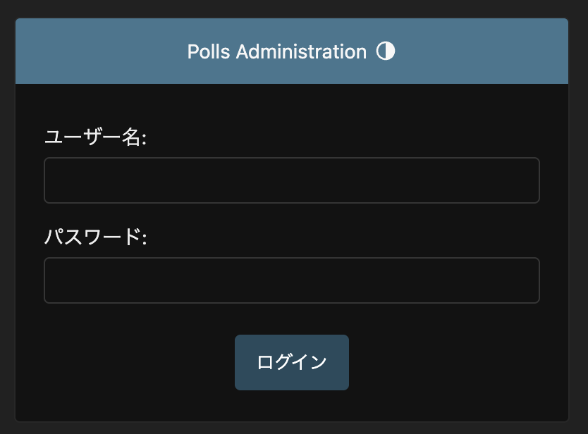

# [escargot](https://github.com/shindy-dev/escargot)

## Abstract
Django勉強用リポジトリ  
ここには環境構築から実際のサイト作成手順を具体的に記載する  
Djangoの概要については[こちら](docs/about/django5.2.1/part1.md)（AI調べ）


## Environment
- ### [Docker Desktop](https://www.docker.com/ja-jp/products/docker-desktop/)
    version 28.0.4, build b8034c0
    今回使用するイメージ：[ghcr.io/shindy-dev/escargot](https://github.com/users/shindy-dev/packages/container/package/escargot)  

    tips. [How to build Docker Image](docs/howto/build_docker_image.md)

- ### [Micromamba](https://mamba.readthedocs.io/en/latest/user_guide/micromamba.html)
    version 2.1.1  
    ※今回使用するコンテナにインストール済みのためセットアップ不要  

    あくまでPythonのバージョン管理として利用し、パッケージ管理はpipで行う

    採用理由(主に消去法により採用)  
    * コンテナ内カーネルのPython環境を汚染したしたくないため
    * コンテナがamd64、ホストOSがmacOS(arm64)である都合上、pyenvでのpython環境構築（クロスコンパイル）が不可だったため
    * anacondaだと肥大化するため

- ### [Python](https://www.python.org/)
    version 3.13.3  
    ※今回使用するコンテナにインストール済みのためセットアップ不要  
    2025年5月時点での最新バージョンを採用

- ### Pythonライブラリ
    ※今回使用するコンテナにインストール済みのためセットアップ不要  
    - ### [django](https://github.com/django/django)==4.2.21
        webアプリのフレームワーク  
        2025年5月時点での最新のバージョンを採用

    - ### [build](https://github.com/pypa/build)==1.2.2.post1
        Pythonパッケージのビルド用ライブラリ  
        2025年5月時点での最新バージョンを採用

## How to build Environment
### Compose Container
```bash
# デーモンプロセスとしてコンテナ起動
docker-compose up -d
```

### Execute Container
```bash
# /bin/bashで実行
docker-compose exec escargot /bin/bash
```

### Compose　and Execute Container
```bash
# コンテナの再作成
bash docker-recompose.sh
```

## escargotプロジェクト作成プロセス
`escargot`プロジェクト作成
```bash
django-admin startproject escargot .
```

Djangoサーバの初期設定〜起動まで
```bash
# shindbに対してescargotアプリで定義したmodelを反映（modelを更新する度に要実行）
python manage.py migrate
# 管理者ユーザーの作成
python manage.py createsuperuser
# サーバー起動（「0:8000」は「0.0.0.0:8000」と同義）
python manage.py runserver 0:8000
```
runserver実行後、以下のメッセージが表示されたら起動成功   
```
(django)[root@escargot escargot]# python manager.py runserver 0:8000
Watching for file changes with StatReloader
Performing system checks...

System check identified no issues (0 silenced).
May 11, 2025 - 20:57:10
Django version 4.2, using settings 'mysite.settings'
Starting development server at http://0.0.0.0:8000/
Quit the server with CONTROL-C.
```
ホストOSから http://localhost:8000/admin/ にアクセスしてページが表示されることを確認


アプリ作成
```bash
python manage.py startapp <app-name>
```

## 参考文献
* [Djangoドキュメント](https://docs.djangoproject.com/ja/5.2/)